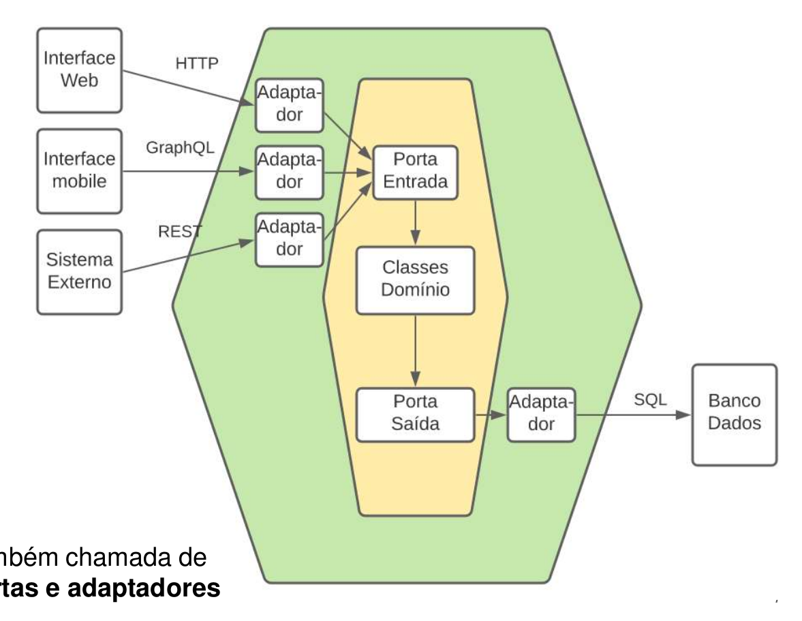

# Arquitetura Hexagonal

- 20223002540 - Lucas Andrade Brandão
- 20203018688 - Mariana Gurgel Ferreira
- 20223002863 - Pedro Augusto de Portilho Ronzani
- 20223003341 - Ulisses Andrade Brandão

# Explicação da implementação da arquitetura

- Aqui temos um exemplo de uma implementação de arquitetura hexagonal.
- A arquitetura hexagonal se baseia em 3 camadas principais, as quais intercomunicam conforme a figura mostrada a seguir:



Essas podem ser vistas como:

1. Interfaces Externas: interfaces que interagem com o mundo externo, como por exemplo, uma interface REST, uma interface gráfica, etc. 
2. Adaptadores: interfaces que interagem com as interfaces externas e com as classes de domínio. Elas são responsáveis por adaptar os dados recebidos das interfaces externas para as classes de domínio e vice-versa.
3. Classes de Domínio: classes que representam o domínio da aplicação. Elas são responsáveis por implementar as regras de negócio da aplicação, fazem comunicação com o banco de dados, etc.

# Implementação Prática

- Neste exemplo, temos uma aplicação que simula um sistema de cadastro de usuários. 
- A aplicação consiste de um backend que gerencia os usuários seguindo essa arquitetura hexagonal.
- O backend é composto por algumas camadas principais: 
    - `controllers`: Essa camada é responsável por receber as requisições HTTP e chamar os serviços necessários.
    - `useCases`: Essa camada é responsável por implementar as regras de negócio da aplicação.
    - `repositories`: Essa camada é responsável por fazer a comunicação com o banco de dados.
    - `entities`: Essa camada é responsável por representar as entidades da aplicação.

- Adaptando isso para as camadas definidas pela arquitetura hexagonal, temos:
    - `adaptadores`: Essa camada é representada pelos controllers e pelos repositories.
    - `classes de domínio`: Essa camada é representada pelos useCases, repositories e entities.

## Estrutura na Prática

- As tecnologias utilizadas nesse exemplo são:
    - `Node.js` como runtime
    - `Fastify` como framework para criar um servidor local
    - `PrismaORM` como ORM para o banco de dados
    - `Zod` para validação de schemas

### Rotas da aplicação

- São definidas em `src/domain/users/@routes/user.routes.ts`

```typescript
export async function userRoutes(app: FastifyInstance) {
    app.post('/', createUserController)                  // Criar usuário
    app.post('/login', loginUserController)              // Logar usuário
    app.get('/name/:name', findUserByNameController)     // Buscar usuário por nome
    app.get('/email/:email', findUserByEmailController)  // Buscar usuário por email
    app.get('/list', listUsersController)                // Listar todos os usuários
}
```

- A partir daqui seguiremos a sequência lógica de criação de usuário.
- A partir do endpoint `POST /`, o controller `createUserController` é chamado.

### Controller de Criação de Usuário

- O controller é responsável por receber a requisição HTTP e chamar o useCase necessário.

```typescript
export const createUserBodySchema = z.object({
	name: z.string(),
	email: z.string(),
	password: z.string(),
});

export async function createUserController(request: FastifyRequest, reply: FastifyReply) {

	const { name, email, password } = createUserBodySchema.parse(request.body); // Parse do body da requisição

	const UsersRepository = new UsersPrismaRepository() // Instanciando o repositório do banco de dados Prisma
	const createUserUseCase = new CreateUserUseCase(UsersRepository) // Instanciando o useCase

	const user = await createUserUseCase.execute({ name, email, password }); // Chamando o useCase

	if (user.isLeft()) // caso o resultado seja um 'erro', retorna um aviso de erro
		return reply
			.status(409)
			.send(user.value.error)

	return reply
		.status(201) // caso o resultado seja um 'sucesso', retorna o usuário criado
		.send(user.value.user);
}
```

### UseCase de Criação de Usuário

```typescript

interface CreateUserUseCaseRequest { // Interface de requisição do useCase
    name: string
    email: string
    password: string
}

type CreateUserUseCaseResponse = Either< // Tipo de resposta do useCase
    { error: ResourceAlreadyExistsError }, 
    { user: User }
>

export class CreateUserUseCase {

    constructor(private usersRepository: UsersRepository) { }

    async execute({ email, name, password }: CreateUserUseCaseRequest) // Método de execução do useCase
        : Promise<CreateUserUseCaseResponse> { // Retorna um Either (sucesso = User | erro = ResourceAlreadyExistsError)

        const findUserByEmailUseCase = new FindUserByEmailUseCase(this.usersRepository) // Instanciando o useCase de busca por email

        const possibleUser = await findUserByEmailUseCase.execute({ email }) // Chamando o useCase de busca por email
        if (possibleUser.isRight()) // Caso ja exista um usuário com o email fornecido, retorna um erro
            return left({ error: new ResourceAlreadyExistsError(`User with email '${email}'`) })

        const user = await this.usersRepository.create({ email, name, password }) // Caso não exista, chama o método de criação de usuário definido no repositório

        return right({ user }) // Retorna o usuário criado
    }
}
```

### Interface Repositório de Usuários

- Aqui define-se os métodos a serem implementados por repositórios específicos da tabela de usuários
- Isso se faz para garantir que qualquer repositório que implemente essa interface tenha os métodos necessários para a aplicação (Inversão de Controle)

```typescript
export interface UsersRepository {
    create(data: UserProps): Promise<User>
    findByName(name: string): Promise<User | null>
    findByEmail(email: string): Promise<User | null>
    login(email: string, password: string): Promise<User | null>
    list(): Promise<User[]>
}
```

- Aqui temos a implementação da interface para o banco de dados usado na aplicação: PrismaORM

```typescript
export class UsersPrismaRepository implements UsersRepository {
    
    async create(data: UserProps): Promise<User> {
        const user = await prisma.user.create({ data });
        return new User(user, new UniqueEntityID(user.id))
    }

    async findByEmail(email: string): Promise<User | null> {
        const user = await prisma.user.findFirst({ where: { email } });
        return (user ? new User(user, new UniqueEntityID(user.id)) : null);
    }

    // Demais métodos implementados de forma similar
}
```

- Assim, temos a implementação da arquitetura hexagonal na prática, com a separação das camadas de acordo com a arquitetura hexagonal, em que as interfaces externas (frontend) se comunicam com os adaptadores (controllers), que por sua vez se comunicam com as classes de domínio (useCases, repositories e entities), e retornam o resultado para a interface a qual chamou.